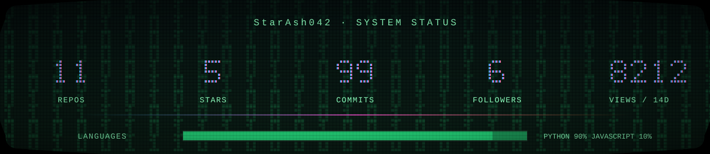

<div align="center">



<a href="https://github.com/StarAsh042">
  
</a>

<p>
  
  <a href="https://StarAsh042.github.io"></a>
  <a href="https://twitter.com/StarAsh042"></a>
</p>

</div>

---

## 🎮 About Me

```yaml
name:      StarAsh042
role:      Game Scene Modeler / 3D Artist
company:   Keywords Studios
location:  Chengdu · Sichuan · China
focus:     Game Engines · AIGC · 3D Toolchain Automation
motto:     "42 reboots, still StarAsh."
```

- 🎨 **游戏场景建模师** —— 来自中国 · 四川 · 成都
- 🧩 喜欢用 **Blender + Python** 把重复的美术流程打磨成一键插件
- 🧠 业余时间研究 **游戏引擎** 与 **AIGC**，探索 AI 与 3D 工作流的结合
- 🛠️ 正在构建一套面向游戏美术的 **自动化工具链**：重拓扑 / 低模质检 / 顶点色 / ComfyUI 节点
- 🌱 持续学习中，欢迎交流建模与工具开发

---

## 🧰 Tech & Tools

**3D · DCC**

<p>
  
  
  
  
  
  
  
  
</p>

**Code · AI**

<p>
  
  
  
  
  
  
</p>

---

## 📊 Stats

<div align="center">




</div>

---

## 📫 Connect with Me

<div align="center">

<a href="https://StarAsh042.github.io"></a>
<a href="https://github.com/StarAsh042"></a>
<a href="https://twitter.com/StarAsh042"></a>

</div>

<div align="center">



</div>
